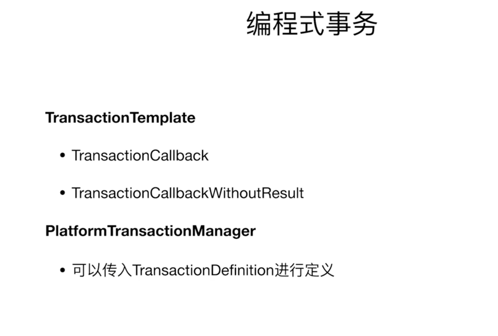
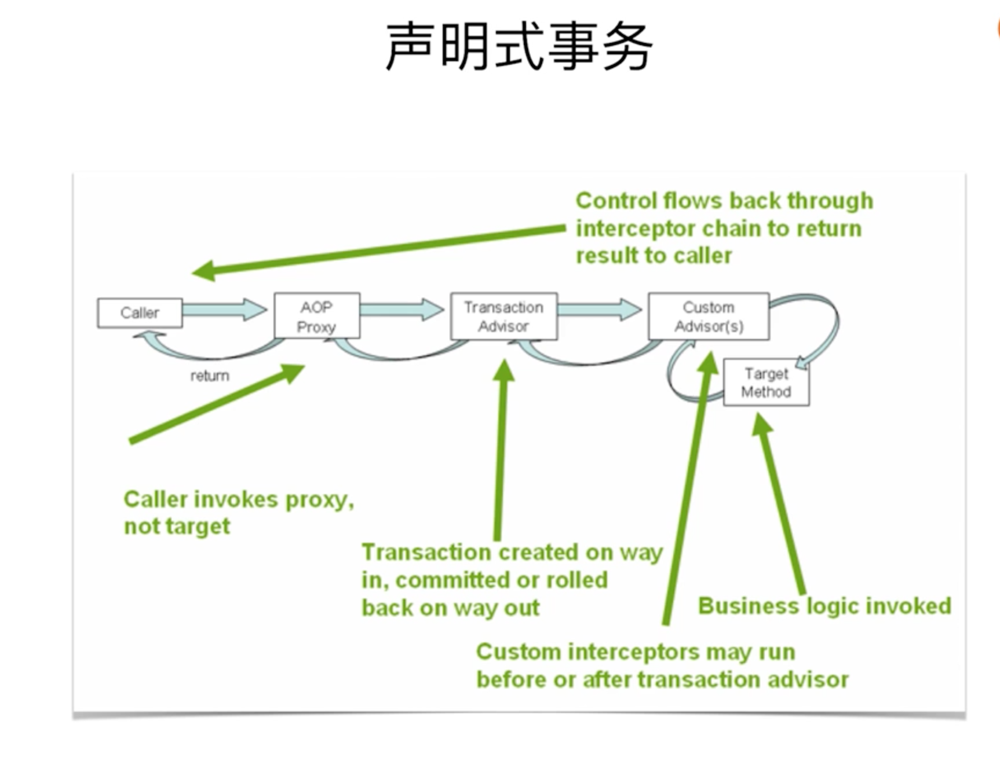
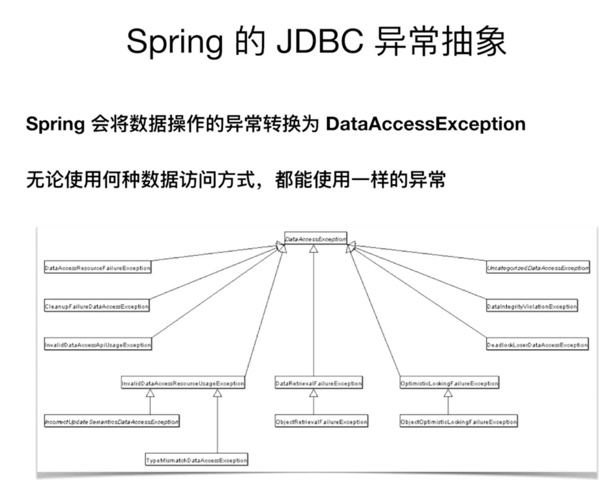
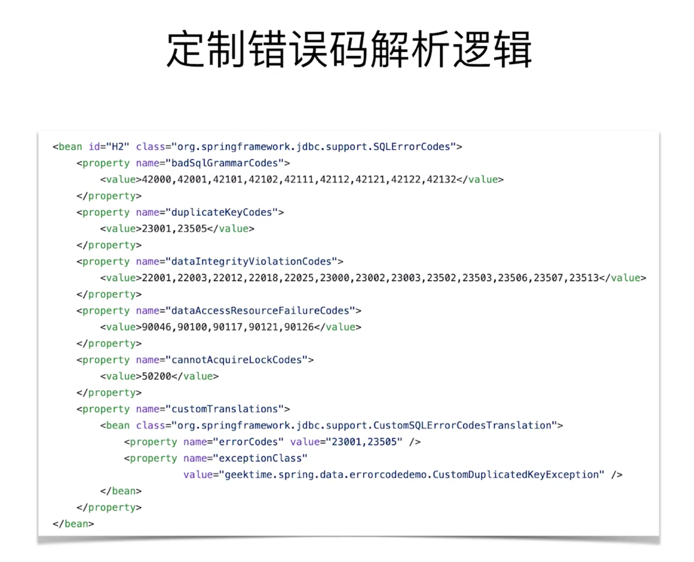
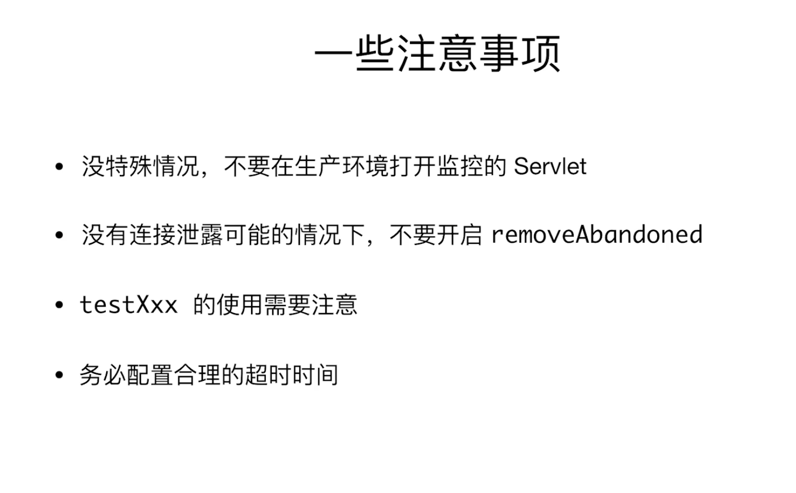
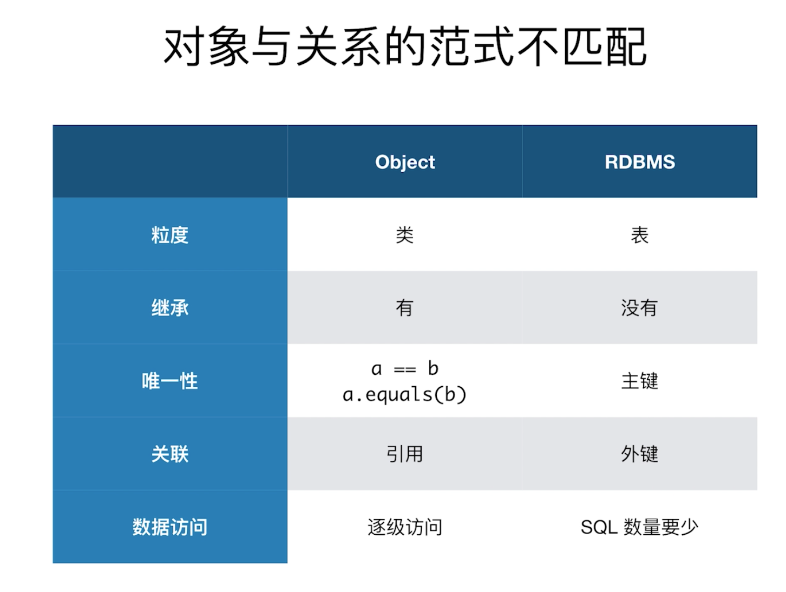
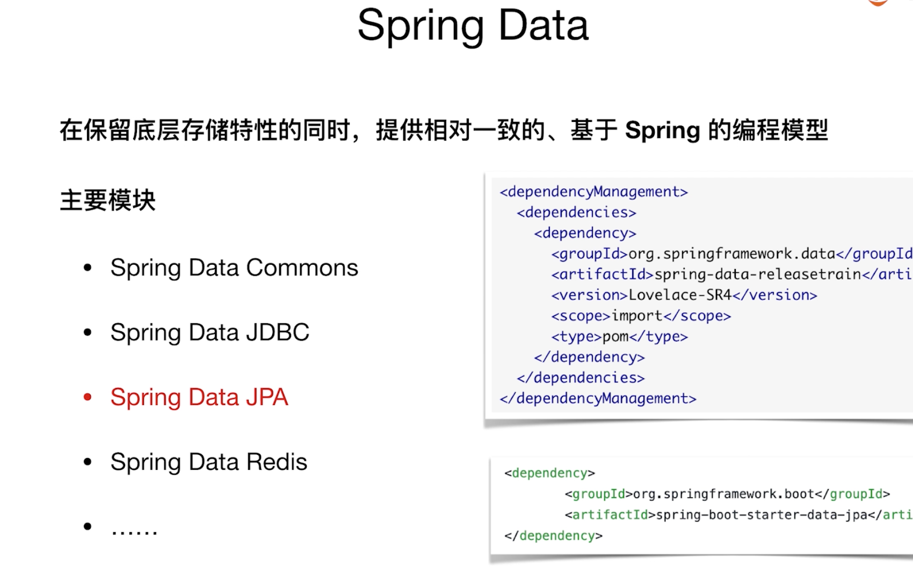

# JDBC相关
##### 1 mvn Spring pom
##### 4 Spring-Example
##### 5 单数据源
##### 6 多数据源
##### 7 连接池Druid
##### 8 Spring JDBC访问数据库
+ core、JdbcTemplate等相关核心接口和类
+ datasource,数据源相关的辅助类
+ object，将基本的JDBC操作封装成对象
+ support，错误码等其他辅助工具

通过注解定义Bean

+ @Component (通用注解通用Bean)
+ @Repository（数据库操作）
+ @Service（业务的服务）
+ @Controller (Spring MVC)
+ @RestController (Rest For Service)

1. 简单的JDBC操作
    + JdbcTemplate
       + query
       + queryForObject
       + queryForList
       + update
       + executeAndReturnKey

###### 简单的JDBC操作

	@Slf4j
	@Repository
	public class FooDao {
	
	    @Autowired
	    private JdbcTemplate jdbcTemplate;
	
	    @Autowired
	    private SimpleJdbcInsert simpleJdbcInsert;
	
	    public void insertData() {
	        Arrays.asList("a","b").forEach(bar -> {
	            jdbcTemplate.update("INSERT INTO FOO (BAR) VALUES (?)", bar);
	        });
	
	        HashMap<String, String> row = new  HashMap<>();
	        row.put("BAR","d");
	        Number id = simpleJdbcInsert.executeAndReturnKey(row);
	        log.info("ID of d: {}", id.longValue());
	    }
	
	    public void listData() {
	        log.info("Count:{}", jdbcTemplate.queryForObject("SELECT COUNT(*) FROM FOO", Long.class));
	        List<String> list = jdbcTemplate.queryForList("SELECT BAR FROM FOO", String.class);
	        list.forEach(row->log.info("Bar:{}",row));
	
	        List<Foo> fooList = jdbcTemplate.query("SELECT * FROM FOO", new RowMapper<Foo>() {
	            @Override
	            public Foo mapRow(ResultSet resultSet, int i) throws SQLException {
	                return Foo.builder()
	                        .id(resultSet.getLong(1))
	                        .bar(resultSet.getString(2))
	                        .build();
	            }
	        });
	
	    }
	}

   
2. SQL的批处理
    + JdbcTemplate
       + batchUpdate
       + BatchPreparedStatementSetter
    + NamedParameterJdbcTemplate
       + batchUpdate
       + SqlParameterSourceUtils.createBatch
       
	   
###### SQL的批处理	   
	   
	@Repository
	public class BatchFooDao {
	
			    @Autowired
	    private JdbcTemplate jdbcTemplate;
	    @Autowired
	    private NamedParameterJdbcTemplate namedParameterJdbcTemplate;
		
		    public void batchInsert() {
		        jdbcTemplate.batchUpdate("INSERT INTO FOO (BAR) VALUES (?)", new BatchPreparedStatementSetter() {
		            @Override
		            public void setValues(PreparedStatement preparedStatement, int i) throws SQLException {
		                preparedStatement.setString(1,"b-"+i);
		            }
		
		            @Override
		            public int getBatchSize() {
		                return 2;
		            }
		        });
		
		        List<Foo> list = new ArrayList<>();
		        list.add(Foo.builder().id(100L).bar("b-100").build());
		        list.add(Foo.builder().id(101L).bar("B-101").build());
		        namedParameterJdbcTemplate.batchUpdate("INSERT INTO FOO (ID,BAR) VALUES(:id,:bar)", SqlParameterSourceUtils.createBatch(list));
		    }
	} 

##### 9 Spring 的事务抽象

+ JDBC、Hibernate/myBatis
+ DataSource/JTA

##### 11 基于注解的配置方式

开启事务注解的方式

+ @EnableTransactionManagement  //注解开启事务
+ <tx:annotation-driven>        //xml开启事务

一些配置

+ proxyTargetClass //基于接口的还是基于类的，有接口使用这种方式(true/false)
+ mode AOP mode选择 默认Java类就好
+ order AOP 拦截的顺序 - 默认最低优先级（自己做的AOP拦截会在事务启动后执行）

@Transcational

+ transactionManager /DatasourceTransactionManager
+ propagation //传播性
+ isolation   //隔离型
+ timeout     //超时
+ readOnly    //只读
+ 怎么判断回滚   

基于注解的配置方式

###### 编程式事务

example -> 11.ProgrammaticTransactionDemo

###### 声明式事务

example -> 11.DeclarativeTransaction

	((FooService) (AopContext.currentProxy())).insertThenRollBack();

##### 12 Spring的JDBC异常抽象

###### 整理笔记📒
Spring 的常用注解

###### Java Config的相关注解
+ @Configuration    //标记当前类是Java配置类
+ @ImportResource   //配置以外的xml文件信息注入
+ @ComponentScan   //Spring容器扫描哪一些package下的Bean配置
+ @Bean //在一个Java Config 的类当中，方法被Bean标记返回一个Bean的配置，存在于Application Context中
+ @ConfigurationProperties //将配置绑定进来，方便使用配置

###### 定义相关注解
+ @Component (通用注解通用Bean)
+ @Repository（数据库操作）
+ @Service（业务的服务）
+ @Controller (Spring MVC)
+ @RestController (Response + Controller Rest For Service)
+ @RequestMapping 方法在那些URL下的映射

###### 注入相关注解
+ @Autowired  
+ @Qualifier  按照类型查找注入进来，可以指定名字
+ @Resource   根据名字进行注入
+ @Value      注入常量或者表达式

###### Actuator 提供的Endpoint

	/actuator/health  健康检查
	/actuator/bean    查看容器中所有的Beans
	/actuator/mapping 查看Web的URL映射
	/actuator/env     查看环境

默认是/actuator/health和/actuator/info可以访问，其他的需要开启

	management.endpoints.web.exposure.include=*
	或者指定多个
	management.endpoints.web.exposure.include=health,bean

	
！！！！！生产环境需要谨慎	
##### 事务传播行为

事务传播行为
所谓事务的传播行为是指，如果在开始当前事务之前，一个事务上下文已经存在，此时有若干选项可以指定一个事务性方法的执行行为。在Propagation枚举定义中包括了如下几个表示传播行为的类型：

+ REQUIRED(0)：如果当前存在事务，则加入该事务；如果当前没有事务，则创建一个新的事务。
+ SUPPORTS(1)：如果当前存在事务，则加入该事务；如果当前没有事务，则以非事务的方式继续运行。
+ MANDATORY(2)：如果当前存在事务，则加入该事务；如果当前没有事务，则抛出异常。
+ REQUIRES_NEW(3)：创建一个新的事务，如果当前存在事务，则把当前事务挂起。(两个事物没有关联)
+ NOT_SUPPORTED(4)：以非事务方式运行，如果当前存在事务，则把当前事务挂起。
+ NEVER(5)：以非事务方式运行，如果当前存在事务，则抛出异常。
+ NESTED(6)：如果当前存在事务，则创建一个事务作为当前事务的嵌套事务来运行；如果当前没有事务，则该取值等价于REQUIRED。（两个事物有关联，外部事物回滚，内嵌事物也会回滚）

这里需要指出的是，前面的六种事务传播行为是 Spring 从 EJB 中引入的，他们共享相同的概念。而NESTED是 Spring 所特有的。以 NESTED 启动的事务内嵌于外部事务中（如果存在外部事务的话），此时，内嵌事务并不是一个独立的事务，它依赖于外部事务的存在，只有通过外部的事务提交，才能引起内部事务的提交，嵌套的子事务不能单独提交。如果熟悉 JDBC 中的保存点（SavePoint）的概念，那嵌套事务就很容易理解了，其实嵌套的子事务就是保存点的一个应用，一个事务中可以包括多个保存点，每一个嵌套子事务。另外，外部事务的回滚也会导致嵌套子事务的回滚。

    @Transactional(rollbackFor = RollbackException.class, propagation = Propagation.REQUIRES_NEW)

Example --> 14.TransactionProgrammaticDemo

##### Alibaba Druid
慢SQL日志

系统属性配置

+ druid.stat.logSlowSql=true //慢sql日志
+ druid.stat.slowSqlMillis=3000 //默认监控超过3s的语句

Spring Boot

+ spring.datasource.druid.stat.enabled=true
+ spring.datasource.druid.stat.log-slow-sql=true
+ spring.datasource.druid.stat.slow-sql-millis=3000

Example --> 14.Druid-demo

# O/R Mapping 相关

JDBC是各种操作的基础，JPA是个规范，Hibernate是JPA的一种实现，Spring Data JPA用的是Hibernate，MyBatis是另一种ORM的框架，Hibernate不用自己手写SQL，但其实复杂的HQL写到最后跟写SQL也没啥大差别

##### Spring Data JPA

##### Hibernate
+ 一款开源的对象关系映射（Object / Relational / Mapping）框架
+ 屏幕底层数据库的各种细节
+ 解放双手👐，95%的数据存储工作解放

常用JAP注解

实体

+ @Entity  实体
+ @MappedSupperclass 多个实体有父类
+ @Table(name) 实体与对应的表关联起来

主键

+ @Id 表的主键
   + GeneratedValue(strategy, generator) //主键的生成策略，生成器是什么
   + @SequenceGenerator(name, sequenceName) //什么样的序列
   
映射

+ Column(name, nullable, length, insertable, updatable) //定义属性与表里面的映射关系（字段名、是否为空、长度，只能插入不能改、还是可以改）
+ @JoinTable(name), @JoinColumn(name)(关联的时候使用)

关系（表的关系）

+ @OneToOne, @OneToMany, @ManyToOne, @ManyToMany
+ @OrderBy

###### Project Lombok
常用功能

+ @Getter / @Setter   
+ @ToString
+ @NoArgsConstructor / @RequiredArgsConstructor / @AllArgsContructor
+ Data
+ Builder
+ Slf4j / @CommonsLog / @Log4j2   

###### 子类继承基类后，使用＠Data注解会有编辑器底色警告，告知你在生成hashcode等过程中，基类的内容不会被生成。此时，要添加@EqualsAndHashCode(callSuper=true)即可手动标记子类hash时要调用父类的hash方法对属于父类的部分内容生成哈希值。此时就不会报警告了。（包括下面那句@ToString(callSuper = true)也是一样）

如果觉得此方式比较麻烦的话（每个类都要），可设置lombok的配置文件lombok.config来解决：
　　
①lombok.config文件需要放在src/main/java文件夹下的目录中（也可以放在实体同级目录下），其它位置无效。内容如下：
　　

	config.stopBubbling=true
	lombok.equalsAndHashCode.callSuper=call
		
		
②然后，在ｐｏｍ加入插件：
　　      
     
	<plugin>
	   <groupId>org.apache.maven.plugins</groupId>
	   <artifactId>maven-compiler-plugin</artifactId>
	   <configuration>
	      <source>1.8</source>
	      <target>1.8</target>
	   </configuration>
	</plugin>

　　此时，可见@Data编辑器警告底色消失。

###### @lombok.experimental.Accessors(chain = true) 取代 @lombok.Builder, setXXX方法也可以连着调用
		
		@Accessors(chain = true)
		@Data
		public class Coffee {
		    private Long id;
		    private String name;
		}
		
		private void initOrders() {
		final Coffee chain = new Coffee()
		.setId(1L)
		.setName("chain");
	}

+ 是广泛使用门面日志库，使用动态查找机制在运行时发现真正的日志库，通过ClassLoader加载日志库，而OSGI中不同插件有不同的ClassLoader，每个线程执行时的ClassLoader都说是不同的，这种能力保证了各插件的相互独立，从而导致commons-logging在OSGI环境中无法正常使用，解决方案就是使用SLF4J
+ SLF4也是广泛使用的门面日志库，但是他是使用编译期静态绑定真正的日志库，通OSGI同时使用时不存在问题。

Example --> 17.SpringBucks

##### Repository

@EnableJpaRepositories

Repository<T,ID> 接口

+ CrudRespository<T, ID>
+ PagingAndSortingRepository<T, ID>
+ JpaRepository<T, ID>

Example --> 18.Jpa-Demo

##### 定义查询

+ find..By / read..By / query..By / get...By...  查找
+ count..By  计数定义
+ ..OrderBy...[Asc/ Desc] 查询返回有多个记录 排序返回
+ And / Or / IgnoreCase 多个条件
+ Top / First / Distinct 

##### 分页查询

+ PagingAndSortingRepository<T, ID>
+ Pageable / Sort
+ Slice<T> / Page<T>

Example --> 18-2.Jpa-Complex-Demo